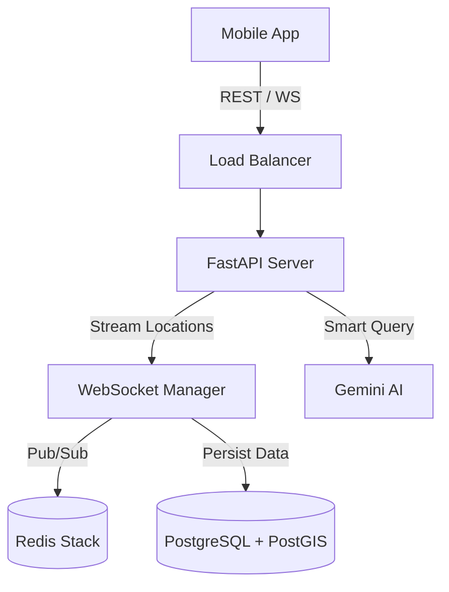

# ARCHITECTURE.md - Project "WeRide"

## 1. High-Level Overview
**WeRide** is a real-time social navigation platform designed to synchronize multi-vehicle trips. Unlike standard navigation apps, WeRide focuses on the **coordination between moving entities**, enabling shared ETA, live relative positioning, and democratic decision-making for stops.

## 2. Technology Stack

### 2.1 Backend & Core Logic
* **Language:** Python 3.11+
* **Framework:** FastAPI (Async I/O).
* **Real-Time Engine:** WebSockets (via FastAPI).
* **Task Queue:** Arq (Async Redis Queue) or Celery.
* **AI Integration:** Google Gemini 3 (for route optimization & NLP).

### 2.2 Database & Storage
* **Primary DB:** PostgreSQL 15 + **PostGIS** (Required for geospatial queries).
* **Hot Storage / Cache:** Redis Stack (for Pub/Sub channels & Ephemeral state).

### 2.3 Frontend (Mobile)
* **Framework:** React Native (Expo Managed Workflow).
* **Navigation SDK:** Mapbox GL Mobile SDK.
* **State Management:** Zustand + TanStack Query.
* **UI Generation:** Lovable.dev exported code.

### 2.4 DevOps & Infrastructure
* **Local Dev:** Docker Compose.
* **Cloud Provider:** Google Cloud Platform (Cloud Run).

---

## 3. System Architecture Diagram

##  4. Key Modules
4.1 The "WeRide" Engine
- **Location Ingestion**: WebSocket stream -> Redis Update -> Broadcast to Room.

- **Optimization**: Batch write location history to Postgres (do not write every single point to disk).

4.2 The "Smart Stop" Algorithm (Geospatial)
- **Trigger**: "Suggest Stop" requested.

- **Process**: Calculate Centroid of all users -> Create Buffer around routes -> PostGIS ST_Intersection.

- **Result**: Return POIs within the intersection area that minimize detour time.

4.3 Data Models (SQLModel)
- **User**: id, username, current_location (Geography Point).

- **Convoy**: id, destination, active_members.

- **ConvoyMember**: Link table.

## 5. Directory Structure (Monorepo)

/weride-project
│
├── /backend                 # FastAPI Application
│   ├── /app
│   │   ├── /api             # Endpoints
│   │   ├── /models          # SQLModel Definitions
│   │   ├── /services        # Business Logic
│   │   └── main.py
│   ├── Dockerfile
│   └── pyproject.toml
│
├── /mobile                  # React Native (Expo)
│   ├── /src
│   └── app.json
│
├── /infra                   # DevOps
│   └── docker-compose.yml
│
└── ARCHITECTURE.md          # This file